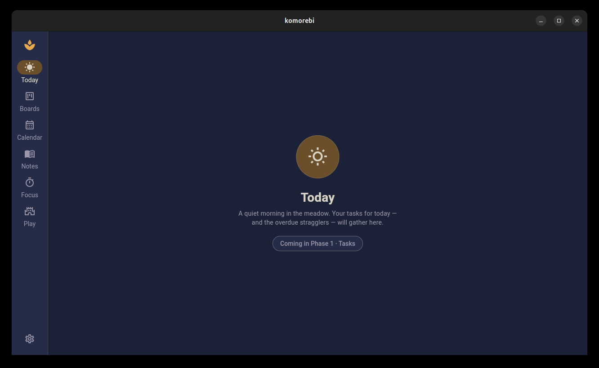
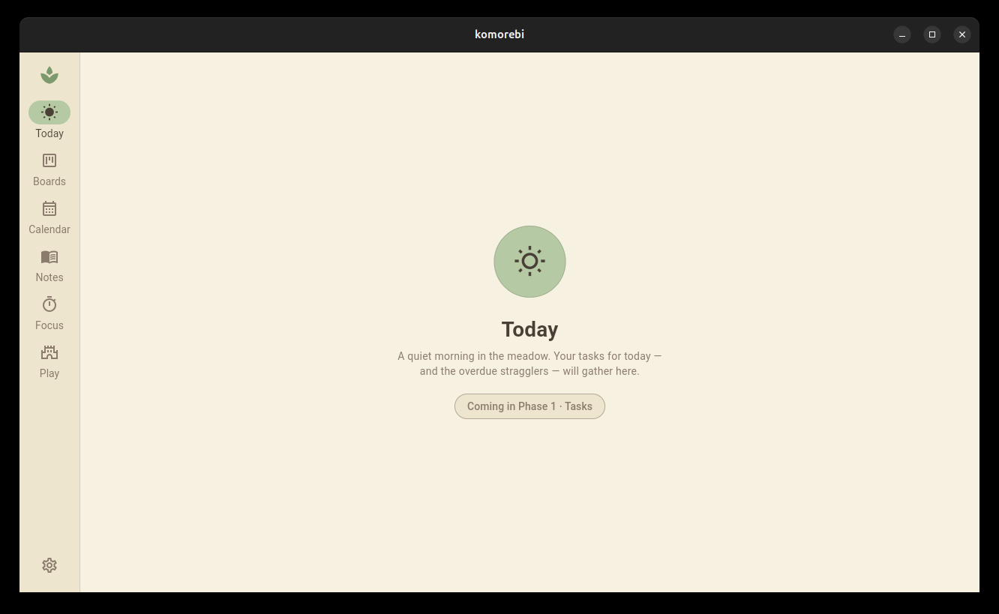
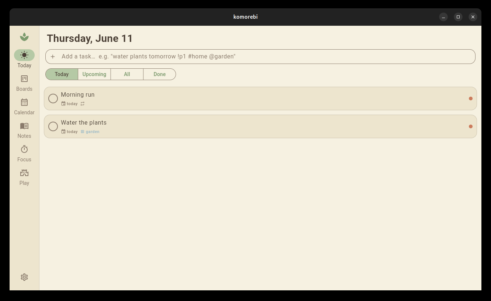
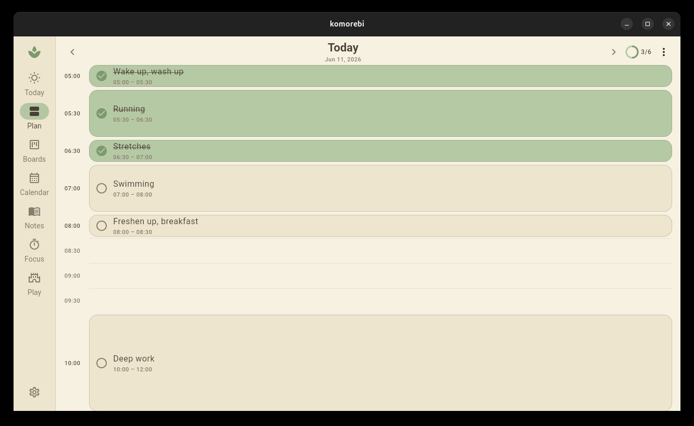
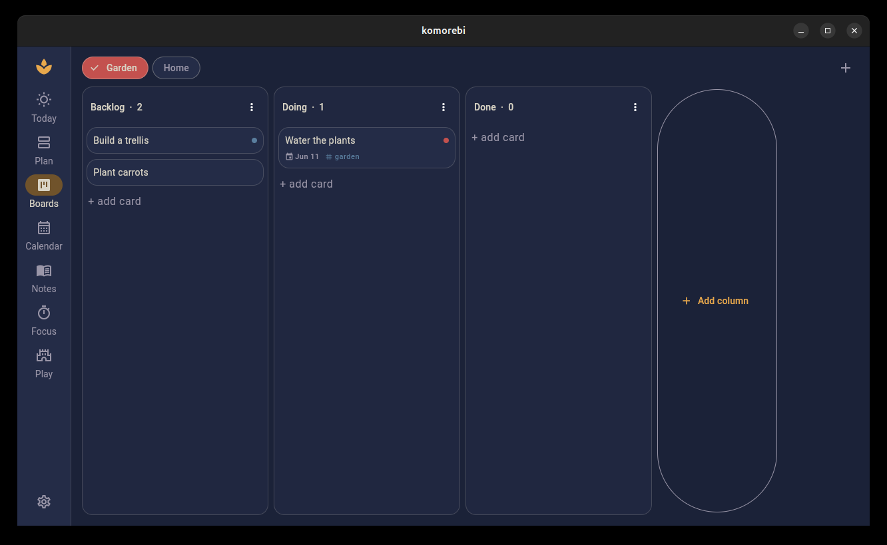
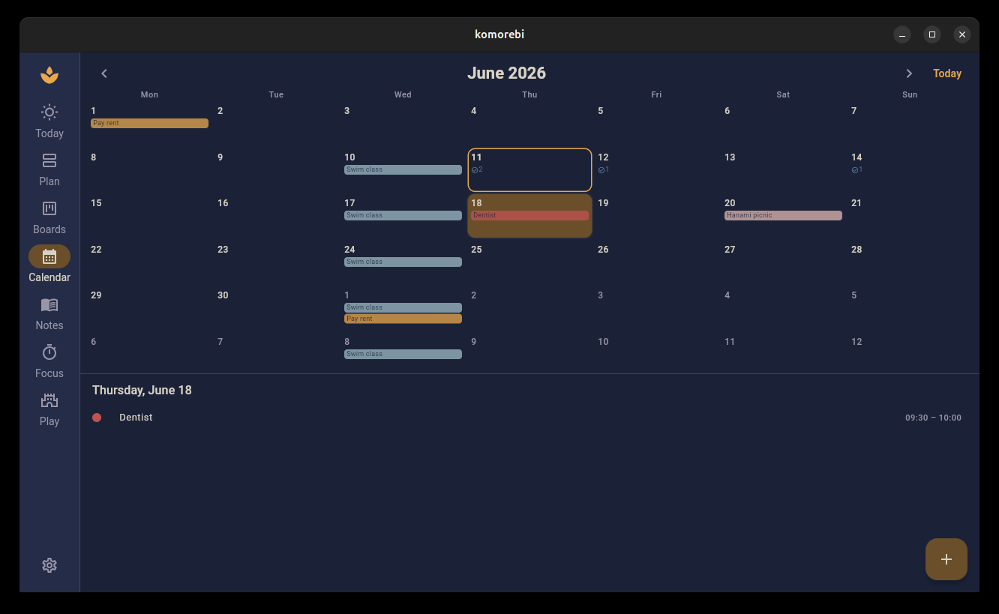

# Komorebi 🍃

> 木漏れ日 — *sunlight filtering through leaves.*

A calm, Studio Ghibli-inspired personal productivity suite: **todo list, kanban
boards, calendar, markdown notes, pomodoro timer — and a physics tower-stacking
game for breaks** (Tricky Towers-style), with opt-in online leaderboards.

Built with Flutter for Linux desktop and Android from one codebase (macOS,
Windows, iOS, and web are unblocked by the stack). **Local-first**: all data
lives in an on-device SQLite database; nothing leaves your device unless you
opt into the Arena leaderboards.

📜 **The full product spec lives in [SPEC.md](SPEC.md)** — vision, design
system, data model, per-module scope, and (deliberately) a *Future improvements*
roadmap for every feature, so each iteration has a documented upgrade path.

## Design

Two hand-tuned themes, switchable in Settings or following the OS:

| | Meadow (light) | Twilight (dark) |
|---|---|---|
| Inspiration | *My Neighbor Totoro* — daytime meadow | *Spirited Away* — evening bathhouse |
| Feel | Cream washi paper, soft greens, warm brown ink | Deep indigo, lantern gold, vermilion |

Tokens live in [`lib/design/`](lib/design/) as a `ThemeExtension`
(`KomorebiTokens`) — widgets never hardcode colors.

## The journey

Komorebi is being built phase by phase — each phase ends with a runnable app,
a green test suite, and a commit. These screenshots are rebuilt from the
actual phase commits (with demo data), so you can watch the app grow:

| | |
|---|---|
| **Phase 0 — Skeleton.** The shell, six empty modules, and both themes. Twilight (*Spirited Away* evening)… |  |
| …and Meadow (*Totoro* daytime), switchable in Settings and persisted. |  |
| **Phase 1 — Tasks.** The Today view fills up: quick-add bar with `tomorrow !p1 #tag @project` syntax, priority dots, tags, recurrence. |  |
| **Phase 1.5 — Day Plan.** Design your ideal day in half-hour slabs (run 5:30–6:30, swim 7–8…), bind routines to weekdays, check blocks off against a day score; months earn calm consistency ranks. |  |
| **Phase 2 — Kanban.** The same tasks, board view: per-project columns, long-press drag & drop, WIP limits. |  |
| **Phase 3 — Calendar.** Events (weekly swim class, monthly rent, all-day picnics) and dated tasks side by side, with a day agenda and local-notification reminders. |  |

*(Regenerate these anytime: check out a phase commit and seed demo data with
`flutter test test/demo_seed_test.dart --dart-define=SEED_DB=<path>`.)*

## Project status

| Phase (SPEC §7) | Deliverable | Status |
|---|---|---|
| 0. Skeleton | App shell, both themes, full DB schema, settings | ✅ done |
| 1. Tasks core | Task CRUD, projects, Today/Upcoming views, quick-add | ✅ done |
| 1.5 Day Plan | Half-hour slab planner, weekday routines, check-offs, monthly consistency ranks | ✅ done |
| 2. Kanban | Boards, columns, drag & drop | ✅ done |
| 3. Calendar | Month view + agenda, events, tasks-on-calendar, reminders | ✅ done (week/day timeline + drag-to-schedule moved to backlog) |
| 4. Notes | Markdown editor + preview, `[[wiki-links]]`, backlinks, search, export | ✅ done (attachments & FTS5 moved to backlog) |
| 5. Pomodoro | Task-linked timer, focus stats | ⬜ |
| 6. Game | "Tsumiki Towers" survival mode (Flame + Forge2D) | ⬜ |
| 7. Polish | Art, sound, animations, export/import, Android build | ⬜ |
| 8. Arena | Profiles, friend codes, shared leaderboards (PocketBase) | ⬜ v1.1 |

## Architecture

```
lib/
├── main.dart              # entry point — opens DB, no blocking I/O before first frame
├── app/                   # MaterialApp.router, go_router routes, adaptive shell
│   ├── app.dart           #   (rail on desktop ≥720px, bottom bar on mobile)
│   ├── router.dart
│   └── shell.dart
├── design/                # the design system — palettes, tokens, ThemeData
│   ├── palette.dart       #   raw colors (only design/ may import this)
│   ├── tokens.dart        #   KomorebiTokens ThemeExtension + context.komorebi
│   └── theme.dart         #   meadowTheme() / twilightTheme()
├── data/
│   ├── ids.dart           # UUIDv7 generator (time-ordered, sync-safe)
│   ├── providers.dart     # Riverpod providers (database, theme mode)
│   └── db/
│       ├── tables.dart    # full SPEC §4 schema; SyncColumns mixin on every entity
│       ├── database.dart  # AppDatabase (Drift) + settings helpers
│       └── database.g.dart  # generated — `dart run build_runner build`
└── features/              # one folder per module; placeholders until each phase lands
    ├── today/  boards/  calendar/  notes/  focus/  play/  settings/
    └── module_placeholder.dart
```

Key decisions (rationale in SPEC §2):

- **Drift/SQLite**, one DB per device. Every table carries UUIDv7 `id`,
  `created_at`, `updated_at`, `deleted_at` — sync-ready for a future
  self-hosted sync server without a rewrite.
- **Riverpod** for state; the database is injected via `databaseProvider`
  (tests override it with an in-memory DB).
- **Deep integration** by schema: todo list and kanban are two views over the
  same `tasks` table; calendar reads tasks with dates; pomodoro sessions and
  notes link to tasks by id.

## Getting started

Prereqs: [Flutter](https://docs.flutter.dev/get-started/install) ≥ 3.44 (stable).

```bash
flutter pub get
dart run build_runner build --delete-conflicting-outputs   # regenerate Drift code after schema changes
flutter run -d linux      # desktop
flutter run -d android    # phone/emulator
```

Linux desktop additionally needs the GTK toolchain:

```bash
sudo apt-get install clang cmake ninja-build pkg-config libgtk-3-dev
```

Web (optional, used for quick previews): `flutter build web`. The Drift web
runtime files `web/sqlite3.wasm` and `web/drift_worker.js` are committed; to
update them grab the latest from the
[sqlite3.dart](https://github.com/simolus3/sqlite3.dart/releases) and
[drift](https://github.com/simolus3/drift/releases) releases.

## Development

```bash
flutter analyze   # lints — keep at zero
flutter test      # widget + database tests
```

Conventions:

- Schema changes go in `lib/data/db/tables.dart` → bump `schemaVersion` and add
  a migration in `database.dart` → re-run build_runner → cover with a test in
  `test/database_test.dart`.
- New module work starts from the corresponding `lib/features/<module>/` folder;
  consume colors via `context.komorebi` / `Theme.of(context)`, never `palette.dart`.
- Every feature addition should also update its *Future improvements* list in
  [SPEC.md](SPEC.md) — the roadmap is part of the product.

## Privacy

No telemetry, no accounts, no network calls — except the future opt-in Arena
(SPEC §5.7), which transmits only game scores and a public player profile to a
self-hosted PocketBase instance, behind a swappable `ArenaApi` interface.

## License

[MIT](LICENSE)
